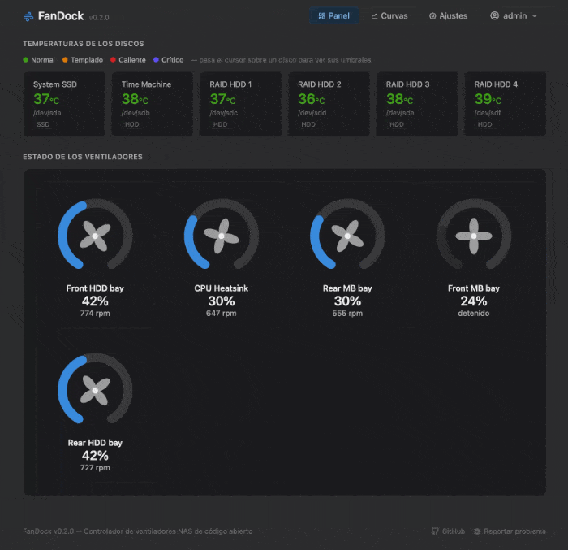
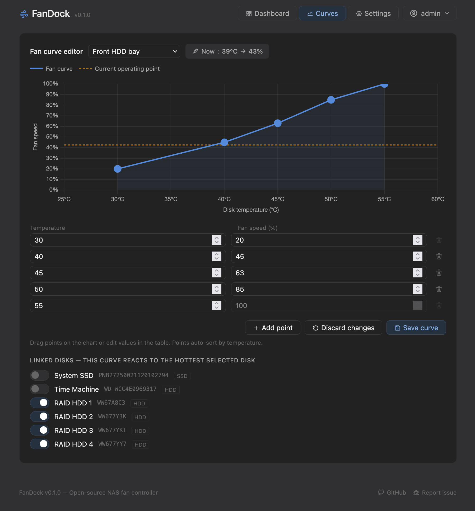
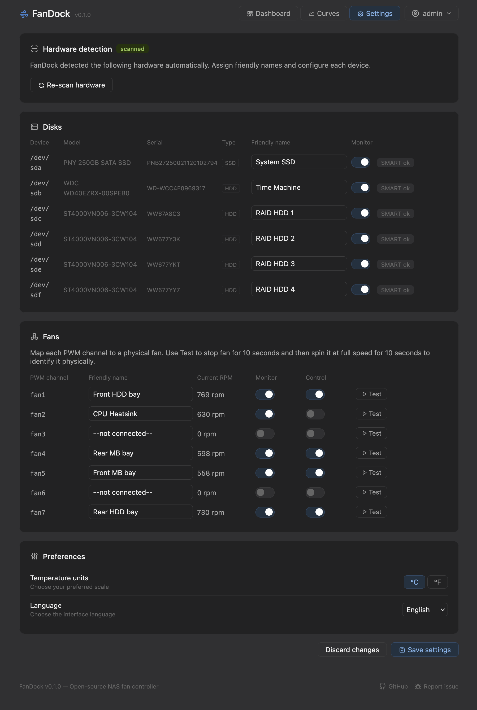

# FanDock 🌀

**Open-source Docker web app to control NAS fan speeds based on disk SMART temperatures.**

[](https://hub.docker.com/r/ismasans/fandock)
[](LICENSE)

---

## Features

- 🌡️ Disk temperature monitoring via SMART (HDD / SSD / NVMe auto-detected)
- 🌀 Fan speed control with customizable fan curves (drag-to-edit)
- 🔒 Simple login / password change
- ⚙️ Hardware auto-scan, friendly names, PWM mapping, Test button
- 🌍 i18n-ready UI. Currently includes English, Spanish, French and German. If you’d like to contribute with new languages, please read the [Adding a language](#adding-a-language) section.
- 🔔 Visual critical alerts (v1.1: email via SMTP)

## Why I built this

I'm a graphic designer, not a developer. My NAS setup (a Fractal Node 804 
with a dual-chamber design) physically separates the disk bay from the CPU, 
which means the BIOS fan curves tied to CPU temperatures were completely 
useless for keeping my drives cool. I looked for existing solutions, tried 
what was available, and found nothing that did exactly what I needed.

So I decided to build it myself — without knowing how to code.

## How I built it

FanDock was built entirely in collaboration with Claude (Anthropic's AI). 
I acted as the product owner: defining what I wanted, testing the results 
on real hardware, and deciding what worked and what didn't. Claude handled 
the implementation.

I think of it like hiring a contractor: I didn't need to know how to lay 
bricks to know whether the wall was straight. What I brought to the project 
was the problem, the hardware context, and the judgment to evaluate results. 
What Claude brought was the technical execution.

The result is a tool that solves a real problem on real hardware — which is, 
ultimately, what software is for.

I'm aware the code may have imperfections, and I've only been able to test 
it on my own setup. If FanDock doesn't work well on your system, please open 
an issue — every report helps make it better for everyone.

## Screenshots






## Installation

### Docker / Docker Compose

```yaml
services:
  fandock:
    image: ismasans/fandock:latest
    container_name: fandock
    privileged: true
    ports:
      - "8080:8080"
    volumes:
      - fandock_config:/app/config
    environment:
      - FANDOCK_SECRET=change_me
    restart: unless-stopped

volumes:
  fandock_config:
```

Then open **http://\<NAS_IP\>:8080** in your browser.

> To use a different port, change **both** values in `ports` to the same number (e.g. `"8888:8888"`).

> Default credentials: `admin` / `fandock` — you will be asked to change your password on first login.

### TrueNAS SCALE Community Edition (Custom App)

Go to **Apps → Discover Apps → Custom App** and fill in the following fields:

**Application Name**
- Any name you like, e.g. `fandock`

**Image Configuration**
- Repository: `ismasans/fandock`
- Tag: `latest`
- Pull Policy: `Pull the image if it is not already present on the host`

**Container Configuration**
- Hostname: `fandock`
- Environment Variables → Add:
  - Name: `FANDOCK_SECRET` / Value: `your_secret_here` (choose something secure)
- Restart Policy: `Unless Stopped`

**Security Context Configuration**
- Enable **Privileged** ✓

**Network Configuration**
- Host Network: disabled
- Ports → Add:
  - Port Bind Mode: `Publish port on the host for external access`
  - Host Port: any available port on your NAS (e.g. `31080`)
  - Container Port: `8080`
  - Protocol: `TCP`

**Portal Configuration** *(optional — adds a direct link button in the Apps UI)*
- Name: `Web UI`
- Protocol: `HTTP`
- Use Node IP: enabled ✓
- Port: same as Host Port above

**Storage Configuration**
- Storage → Add:
  - Type: `Host Path`
  - Mount Path: `/app/config`
  - Host Path: path to a dataset on your NAS (e.g. `/mnt/tank/apps/fandock`)

Leave all other options at their defaults, then click **Install**.

Once running, open **http://\<NAS_IP\>:\<Host_Port\>** in your browser.

> Default credentials: `admin` / `fandock` — you will be asked to change your password on first login.

## Configuration

| Variable | Default | Description |
|----------|---------|-------------|
| `FANDOCK_SECRET` | `change_me` | JWT secret key — change this! |
| `FANDOCK_CONFIG_PATH` | `/app/config/config.json` | Path to the configuration file |

## Password Reset

If you forget your password, run this command on the server:

```bash
docker exec fandock python -c "from backend.services.config_service import reset_password; reset_password()"
```

This resets the password to `fandock` and triggers the first-run wizard on next login.

## Stack

| Layer | Technology |
|-------|------------|
| Backend | FastAPI (Python 3.13) |
| Frontend | HTML + JS + Chart.js |
| Container | Single Docker image |
| Config | JSON on mounted volume |

## Roadmap

| Version | Feature |
|---------|---------|
| v0.3.0 | Bug fixes and polish based on real-world usage |
| v1.0.0 | Stable release |
| v1.1.0 | Email alerts via SMTP |
| v1.2.0 | Extended NVMe support |

## Adding a language

FanDock uses simple JSON files for translations. To add a new language:

1. Copy `frontend/static/js/i18n/en.json` to a new file named with the 2-letter language code (e.g. `pt.json` for Portuguese)
2. Also change `"_name": "English",` at the top of the file with the name of the language (e.g. `"_name": "Português"`).
3. Translate all the values — do not change the keys
4. Open a Pull Request

No JavaScript knowledge required — only the JSON file needs translating.
The new language will be detected and added to the selector automatically.

## License

MIT © ismasans